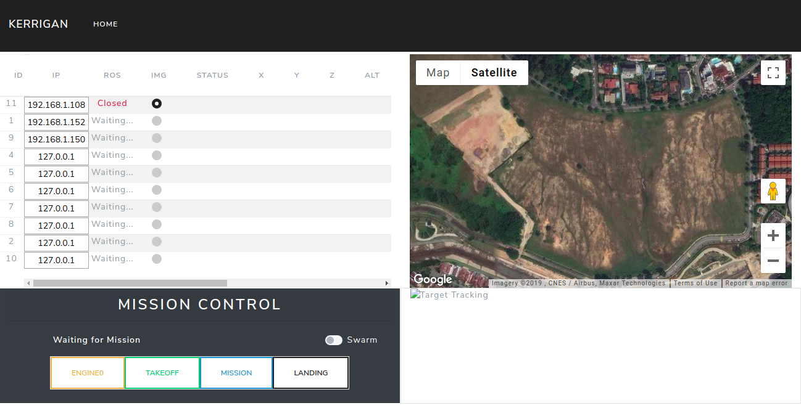

# Kerrigan UI 
# overview
Ｔhis package is for web-based UI shown as the image. It can connect to multiple drones by their IP address and show status of each drone, such as positon, image, healthy status etc. User can sent commands (takeoff, mission, landing) to drone directly from the UI. Moreover, a Google map is inserted to show realtime location of the drone. 



**User Interface**

# Installation
## Developer (Optional)
### 1. Download tools in Vscode on host PC 
- Bootstrap 4, Font awesome 4, Font Awesome 5 Free & Pro snippets.

    This is the framework itself with couple of additional features which contain ready-to-use templates and other stuff useful while developing in bootstrap.

- Live Server 

    To see your web UI changes in realtime

- Prettier Code formatter 

    To keep your source code clean

- vscode-icons 

    To make your workspace look good

### 2. Download js scripts (optional) 

    Download necessary js files and then add to your local repo if you don't want to use them online. It could be tricky as the js script has many versions and may not work very well on your projects. Need to try them out and choose the working one. 

### 3. Deploy (optional)
After the development stage, you will have to deploy the web page, thus it can be accessed by IP adress from any other devices.

- Packages Installation
  - nginx
    ```
    $ sudo apt-get update
    $ sudo apt-get install nginx
    ```
  - MySQL
    ```
    $ sudo apt-get install mysql-server
    ```
  - PHP
    ```
    $ sudo apt-get install php php-mcrypt php-mysql
    ```
  - nodejs
    ```
    $ sudo apt-get install nodejs
    ```
- Setup
  - Make sure the www-data user can access the FULL path of the website folder!!! 
    ```
    $ chmod 755 folder_name
    ```
  - Config nginx
    ```
    $ sudo gedit /etc/nginx/sites-enabled/default
    find line:
    $ root /var/www/html;
    and change value /var/www/html to the path to your app.
    root /media/nvidia/SD/catkin_ws/src/ddrone_v2/ddrone_ui/index.html;
    ```
  - Restart Nginx:
    ```
    $ sudo systemctl restart nginx
    ```

## Onboard TX2 setup
###  Download ros web server packages
- web_video_server
    ```
    $ sudo apt-get install ros-kinetic-web-video-server
        It launches the server for streaming ROS image messages as video through the web.
    ```
-  rosbridge_server
    ```
    $ sudo apt-get install ros-kinetic-rosbridge-suite
    It launches the web sockets to allow web apps to publish or subscribe ROS messages.
    ``` 
- tf2-web-republisher
   ```
   $ sudo apt-get install ros-kinetic-tf2-web-republisher
   ```
### Put the following contents in ui.launch under your_packages
```
<!-- -->
<launch>
  <node pkg="web_video_server" type="web_video_server" name="web_video_server"/>
  <include file="$(find rosbridge_server)/launch/rosbridge_websocket.launch" />
  <node pkg="tf2_web_republisher" type="tf2_web_republisher" name="tf2_web_republisher" />
</launch>
```


# Usage
## 1. Run UI launch file on the onboard PC
```
$ roslaunch your_packages ui.launch
(e.g. $ roslaunch ddrone_task_manager ddrone_ui.launch)

```

## 2. Access UI web page on local ground station

- Access From Vscode
- 
  - Open your workspace with Vscode
  - Right click index.html in your Vscode
  - Click "Open with Live Server" and then the web will show up in your browser

- Access by IP
  
  Put the 127.0.0.1 in any web browswer, you will be able to see the UI if you set everything correctly
   

# Tutorials and useful websites
1. [Bootstrap 4 + ROS](https://medium.com/husarion-blog/bootstrap-4-ros-creating-a-web-ui-for-your-robot-9a77a8e373f9)
2. [Bootstrap 4 Tutorial](https://www.w3schools.com/bootstrap4/default.asp)
3. [ROBOTWEBTOOLS](http://robotwebtools.org/tools.html)
4. [Theme](https://bootswatch.com/)
5. [HTML color code](https://www.rapidtables.com/web/color/html-color-codes.htmls)
 


